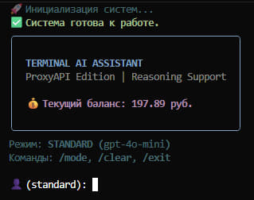
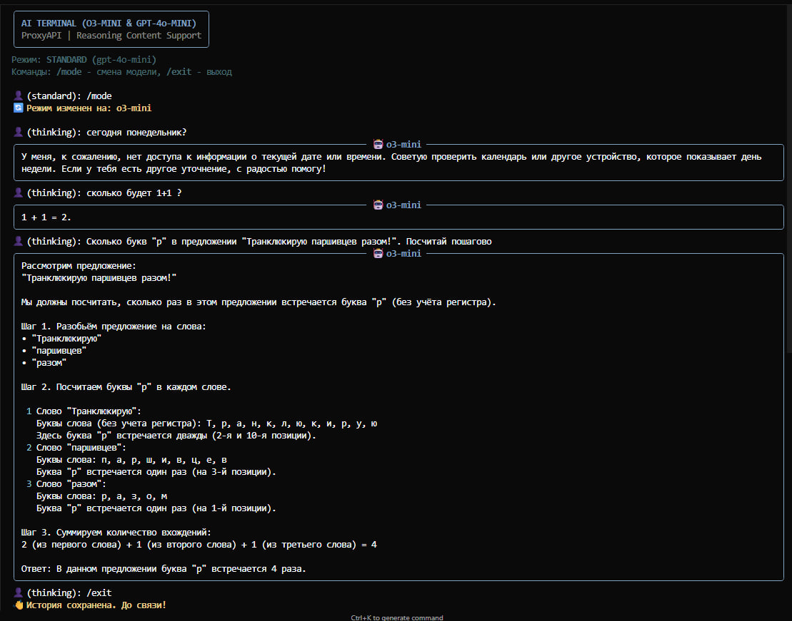

# vibe-ai-assistant
Консольный ассистент на Python для работы с OpenAI/ProxyAPI с поддержкой Reasoning моделей

## Основные возможности
- **Два режима работы**: Переключение между легкой (`gpt-4o-mini`) и "думающей" (`o3-mini`) моделями.
- **Reasoning Support**: Отображение процесса размышлений (Internal Thoughts) в отдельной панели.
- **Контроль баланса**: Автоматическая проверка остатка средств на счету ProxyAPI при запуске.
- **История диалога**: Автоматическое сохранение и подгрузка контекста из `chat_history.json`.
- **Надежность**: Обработка таймаутов (150с), сетевых ошибок и ошибок оплаты (402).
- **Интерфейс**: Красивый рендеринг Markdown и системных логов с помощью библиотеки `Rich`.

## Установка
1. Установите зависимости: `pip install -r requirements.txt`
2. Создайте файл `.env` и добавьте свой ключ:
   ```env
   PROXY_API_KEY=ваш_ключ
   BASE_URL=https://api.proxyapi.ru/openai/v1
   DEFAULT_MODEL=gpt-4o-mini
   THINKING_MODEL=o3-mini

## 🛠 Технологии
- **Python 3.10+** (основная логика)
- **OpenAI SDK** (интеграция с API)
- **Rich** (профессиональная стилизация терминала)
- **Python-dotenv** (безопасное хранение ключей)
